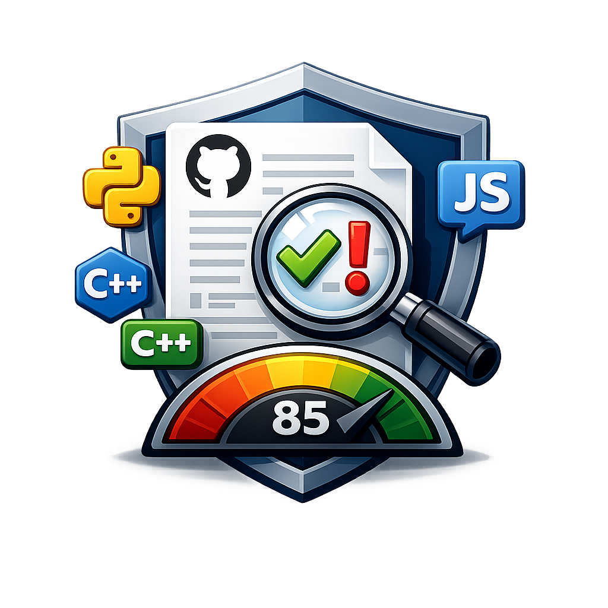

<div align="center">



# Repo Inspector — проверка GitHub-репозиториев через API


**Анализ репозитория без клонирования и без запуска кода: score, категории, рекомендации, SVG/JSON карточки**

[Русская версия](README.md) • [English version](README_EN.md)

[Возможности](#-возможности) • [Примеры карточек](#-примеры-работоспособности) • [Быстрый старт](#-быстрый-старт) • [Деплой](#-деплой-pages--vercel) • [API](#-api)

</div>

---

## ✨ Возможности

- Проверка репозитория по URL (`https://github.com/<owner>/<repo>`) через GitHub API.
- Категории оценки: `Docs`, `CI`, `Security`, `Quality`, `Maintenance`, `Governance`.
- Статусы проверок: `pass` / `warn` / `fail`, итоговый score `0..100`.
- История сканов и тренд по коммитам.
- Экспорт отчёта в `JSON`, `Markdown`, `TXT`.
- SVG/JSON API в стиле `github-readme-stats`.
- Двуязычность интерфейса и отчётов (`RU` / `EN`).
- Режимы работы:
  - локально (FastAPI + SQLite),
  - статический фронт на GitHub Pages,
  - API на Vercel.

---

## 🧪 Примеры работоспособности

> Это реальные embed-примеры карточек, которые можно вставлять в README.

### Quality card


### Repository stats card


### Кастомная тема (пример)

```md

```

---

## 🚀 Быстрый старт

### Требования

- Python `3.11+`
- Git

### 1) Клонирование и установка

```bash
git clone https://github.com/Overl1te/Repo-Inspector.git
cd Repo-Inspector

python -m venv .venv
# Windows:
.venv\Scripts\activate
# Linux/macOS:
source .venv/bin/activate

pip install -r requirements.txt
pip install -e .[dev]
```

### 2) Конфиг (`config.yml`)

Проект использует **открытый YAML-конфиг** (без обязательного `.env`).

```yaml
app:
  name: "Repo Inspector"
  logo_path: "/static/logo.png"
  title_separator: "-"

github:
  token: ""          # опционально, для повышения лимитов GitHub API
  app_token: ""
  api_base: "https://api.github.com"

database:
  url: "sqlite:///./data/app.db"

scan:
  rate_limit_per_minute: 25
  daily_quota: 300
  cache_ttl_seconds: 1800
  repo_history_keep: 20
  stale_active_job_minutes: 120
```

### 3) Запуск

#### Вариант A (Windows)

```bat
run.bat
```

#### Вариант B (любой OS)

```bash
uvicorn app.main:app --reload
```

Открыть: `http://127.0.0.1:8000`

---

## 🌐 Режимы работы

### 1) Local interactive mode

- UI + API работают локально.
- Репозиторий сканируется в фоне через FastAPI `BackgroundTasks`.

### 2) GitHub Pages mode

- Статический интерфейс в `web/`.
- Отчёты генерируются GitHub Actions в `web/reports/*.json`.

### 3) Hybrid mode (рекомендовано)

- GitHub Pages: фронт и генератор.
- Vercel: живой API (`/api?...`) и SVG/JSON карточки.

---

## 🔌 API

### Основные endpoint'ы

- `POST /api/scan` — запуск скана
- `GET /api/jobs/{job_id}` — статус задачи
- `GET /api/report/{job_id}.json` — JSON отчёт
- `GET /api/report/{job_id}.md` — Markdown отчёт
- `GET /api/report/{job_id}.txt` — TXT отчёт
- `GET /api?owner=<owner>&repo=<repo>&kind=repo|quality&format=svg|json` — readme-stats API
- `GET /health`, `GET /metrics`

### Быстрые примеры

```bash
curl -X POST http://127.0.0.1:8000/api/scan \
  -H "Content-Type: application/json" \
  -d '{"repo_url":"https://github.com/tiangolo/fastapi"}'

curl "http://127.0.0.1:8000/api?owner=Overl1te&repo=Repo-Inspector&kind=quality&format=json&include_report=true&locale=ru"
```

---

## 🚢 Деплой (Pages + Vercel)

### GitHub Pages (frontend)

1. В репозитории: `Settings -> Pages`.
2. `Build and deployment: GitHub Actions`.
3. Запушить изменения (или запустить workflow деплоя pages).
4. Настроить `web/config.js`:

```js
window.REPO_INSPECTOR_CONFIG = {
  API_BASE: "https://repo-inspector.vercel.app/",
};
```

### Vercel (API)

1. Import project в Vercel.
2. Root directory: `./`.
3. Деплой (используется `vercel.json` + `api/index.py`).
4. Проверка:
   - `https://<your-domain>/health`
   - `https://<your-domain>/api?owner=Overl1te&repo=Repo-Inspector&kind=repo`

---

## 🧱 Структура проекта

```text
Repo-Inspector/
├── app/                    # FastAPI, scanner, шаблоны, локализация
├── api/                    # serverless entrypoint для Vercel
├── web/                    # статический frontend (Pages)
├── scripts/                # генерация отчётов/утилиты
├── tests/                  # unit tests
├── config.yml              # публичный runtime-конфиг
├── requirements.txt
├── Dockerfile
├── docker-compose.yml
└── run.bat
```

---

## 📚 Документация и governance

- [docs/PROJECT_STRUCTURE.md](docs/PROJECT_STRUCTURE.md)
- [CODE_OF_CONDUCT.md](CODE_OF_CONDUCT.md) / [CODE_OF_CONDUCT_EN.md](CODE_OF_CONDUCT_EN.md)
- [CONTRIBUTING.md](CONTRIBUTING.md) / [CONTRIBUTING_EN.md](CONTRIBUTING_EN.md)
- [SECURITY.md](SECURITY.md) / [SECURITY_EN.md](SECURITY_EN.md)
- [TERMS_OF_USE.md](TERMS_OF_USE.md) / [TERMS_OF_USE_EN.md](TERMS_OF_USE_EN.md)
- [CITATION.cff](CITATION.cff)

---

## 🧪 Разработка

```bash
ruff check .
pytest -q
```

---

## 📄 Лицензия

GNU GPL v3 — см. [LICENSE](LICENSE).

## 🚦 Проверка перед деплоем

Перед выкладкой запустите встроенный pre-deploy чек:

```bash
python scripts/predeploy_check.py
```

Строгий режим (включает линтер и тесты):

```bash
python scripts/predeploy_check.py --strict
```

Подробный чеклист: [`docs/DEPLOYMENT.md`](docs/DEPLOYMENT.md)
